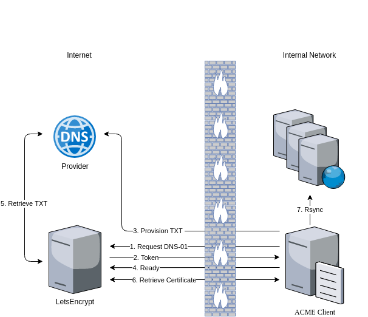

# Behind The Firewall Certificate Authority (CA) Demo

The overall goal of this repository is to demonstrate automated SSL certificate **creation** and **renewal** for **behind the firewall** web services so that they can get that [LetsEncrypt](https://letsencrypt.org/) type of experience for automated deployments. **Specifically** for Continuous Integration and Continuous Delivery (CI/CD) situations where there are **hard security requirements** and there is **no access to the internet** from the internal network.

# Why
For web applications, communicating over SSL/HTTPS is a must. Unencrypted traffic over HTTP is a security risk. 

This is nothing new and it is hard to find a public web service in production which is not secured with SSL/HTTPS.

Non production environments is a completely different story though.

As a DevOps consultant I can't count the number of times I have seen **non production**, `dev`, `test`, `qa`, `staging`, environments running plain HTTP.

I think the main reasons for this, generally speaking, is: 

* These environments are often behind a firewall and **not** exposed to the external world. Therefor developers don't really feel the need to aquire a certificate as they feel *safe* on the intranet/LAN.
* The process of getting and renewing a certificate is often time consuming when [LetsEncrypt](https://letsencrypt.org/) cannot be used.
* The process is often manual which does not fit with development processes driven by CI/CD.

Ask any security expert and they will tell you that networks are comprimised all the time and unencrypted traffic is vulnerable. That feeling of safety is **false**.

Development teams who practice CI/CD work at speed. Release cycles are frequent for both old and new deliveries. Waiting on the creation of a certificate is not an option. That new service is going to be deployed to the internal environments. Just not with SSL/HTTPS.

In CI/CD the deployment process is automated. Having automated deployments and tests break while waiting for certificate renewal is not an option.

# Approaches

The best way to ensure that any web service is running over HTTPS with a valid certificate is to make it as painless as possible and automated. When you deploy a web service it should just happen!

[LetsEncrypt](https://letsencrypt.org/) made this possible for **public** web services using the Automated Certificate Management Environment ([ACME](https://en.wikipedia.org/wiki/Automated_Certificate_Management_Environment)) protocol. Basically, with the ACME protocol a client asks for a certificate, e.g. helloworld.example.com, from a CA that supports the protocol. The CA will challenge to prove ownership. If the challenge(s) are fulfilled a certificate is issued to the client. 

There are two types of challenges, [HTTP-01](https://letsencrypt.org/docs/challenge-types/#http-01-challenge) and [DNS-01](https://letsencrypt.org/docs/challenge-types/#dns-01-challenge). 

* With HTTP-01 the client puts a file locally with a token given by the CA. The CA then retrieves the file. If successful and everything matches up properly then a certificate is generated which the client retrieves. Port 80 **must** be open on the client side.

* With DNS-01 the CA wants you to prove control of your domain. In this case the CA expects a TXT record to be put under that domain name. The client is responsible for this. If successful and everything matches up the certificate is generated and the client retrieves it. This means you need to have control over the domain and a DNS provider that supports the ACME protocol.

In either case the client needs to retrive the certificate. So somewhere internet access is needed if you want to use [LetsEncrypt](https://letsencrypt.org/).

## Limited Access

If you have **limited** access to the internet you could do something like.

* A publicly registered domain. E.G. mydomain.net on Route53 or some other DNS provider with ACME support for example.
* One publicly exposed ACME client. Certbot, ACME.sh, etc. Which uses DNS-01 challenge.
* A way to distribute the certs from exposed ACME client to the internal hosts so they can be used by Nginx, Apache2, Traefik, etc.



## Zero Access

If you have zero access to the internet then your only option is to run an internal CA and distribute the root and intermediate certificates to **all** the hosts on the internal network. 

# Solution
The solution I chose is a full Certificate Authority on the internal network. 

* A lot of companies already have internal certificates they distribute to hosts on the internal network. The only piece that is missing is the ACME support. If they don't know how to do this then it is not hard as it is pretty standard.

* This allows HTTP-01 challenge which is simpler. Does not require making an internal domain public and does not require a DNS provider that supports the ACME protocol.

* Finally distributing the certificates (rsync often) from one exposed ACME client to the hosts that needs them is just an added complexity.

# Demo(s)

The demo(s) in this repository use a Certificate Authority (CA), provided by [Smallstep](https://github.com/smallstep/certificates), which supports the [ACME](https://en.wikipedia.org/wiki/Automated_Certificate_Management_Environment) protocol.

Kudos to [Smallstep](https://smallstep.com/) for providing their CA as an **open source** implementation. I encourage you to take a look at there website and see what they have going on.

I have dockerized the CA and created docker-compose file to easily spin it up. There is an entrypoint script to initialize the CA with some values defined in a `.env` file. 

I have also dockerized and created docker-compose files for two proxies (Nginx and Traefik) to demonstrate how to get certificate generation and renewal for a simple hello world web service.

I chose Traefik because it has built in support for ACME. You just need to configure the compose file with the proper values (CA, challenge type, etc) and Traefik will handle everything including certificate renewal.

I chose Nginx because it **doesn't** have built in support for ACME. Smallstep also provides an ACME client which supports certifcate generation and renewal. I baked this into the Nginx image and created an entrypoint script to get the certificate generated and run the renewal daemon. The Nginx configuration just references the certificates that the Smallstep ACME client generates and renews. 

## Quick Start

1. Clone this repository and change directory into it.

    Add the follwoing to your /etc/hosts file. 

    ``` 
    127.0.0.1	helloworld.thedukedk.net
    127.0.0.1	internalCA.thedukedk.net
    ``` 

2. Run `docker-compose up -d`

3. Get the fingerprint from the CA by doing a `docker logs step-ca`.

    ``` 
    docker logs step-ca 

    No configuration file found at /home/step/config/ca.json

    Generating root certificate... 
    all done!

    Generating intermediate certificate... 
    all done!

    ✔ Root certificate: /home/step/certs/root_ca.crt
    ✔ Root private key: /home/step/secrets/root_ca_key
    ✔ Root fingerprint: 17096d30163602c2743f10032126f6a09a71cc0ea023879d980584cd4870c5f3  <---------------
    ✔ Intermediate certificate: /home/step/certs/intermediate_ca.crt
    ✔ Intermediate private key: /home/step/secrets/intermediate_ca_key
    ✔ Database folder: /home/step/db
    ✔ Default configuration: /home/step/config/defaults.json
    ✔ Certificate Authority configuration: /home/step/config/ca.json

    Your PKI is ready to go. To generate certificates for individual services see 'step help ca'.
    ``` 

    Add it to the FINGERPRINT environment variable in the `.env` file.

4. Copy the root and intermediate certificates from the container to your host and add them to the hosts trust store. This is something that would normally be handled by It operations. For my Fedora laptop I copy them to `/etc/pki/ca-trust/source/anchors` and run the command `update-ca-trust`. This is different for different OS's and dsitributions.

5. Run one of the proxies to see the generated certificate.

    For Traefik - `docker-compose -f clients/traefik/traefik-compose.yaml up -d`

    The certificate can be found in the `acme.json` file. E.g. `docker exec traefik bash -c "cat acme.json"`

    For Nginx - `docker-compose -f clients/nginx/nginx-compose.yaml up -d`

    The certificate can be found in the `/acme-certificates` directory. E.g. `docker exec nginx bash -c "ls /acme-certificates"`
